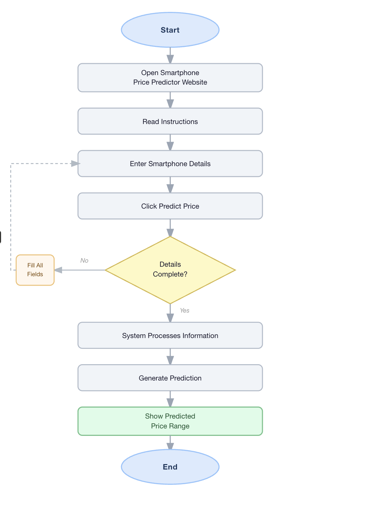

# Smartphone Price Range Classifier

This project predicts smartphone price range using an Artificial Neural Network (ANN) based on specifications like RAM, battery, camera, and storage.

## User Flow

Below diagram shows how the user interacts with the system.

## Project Wireframe

The UI/UX wireframe for the application.

[Open Wireframe](https://app.visily.ai/projects/30c30523-77e7-469f-b3c9-14f17d318c89/boards/2489497)
